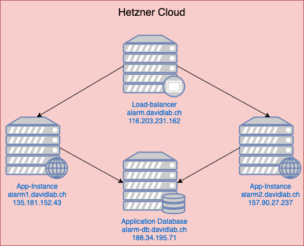

LB3 - LoadBalancer, Datenbank und Web-App
=========================================

Die nachfolgende Dokumentation basiert auf einer Projektarbeit für das Modul 242 an der Technischen Berufsschule Zürich, Zellweger, Docampo, Lippuner

Wir haben uns dafür entschieden einen Temperatur-Alarm mit dem IoT-Board umzusetzen. Das bedeutet, dass wir die Temperatur mittels des Sensors auf dem Board lesen und dann per REST API an eine Web-App übermitteln wollen.

Die Web-App ist für das logging der Einträge verantwortlich. Ausserdem kann über die Web-App ein Temperaturberich festgelegt werden. Bei allen Temperaturen, die ausserhalb dieses Bereiches liegen, wird "Alarm" geschalgen.

Der Alarm, zeigt sich ersten indem die Temperaturanzeige in der Web-App Rot angezegit wird und zweitens auf dem Board ein entsprechendes LED eingeschaltet wird. Ebenfalls wird auch auf dem OLED-Display eine Nachricht ausgegeben die zeigt, was der Fehler nun genau bedeutet.

Der Cloud-Service läuft auf 2 Applikationsinstanzen, einem Load-Balancer und 2 Applikationsinstanzen. 

Projekt selbst aufsetzen
------------------------

* [Hardware Requirements](#Hardware-Requirements)
* [Netzwerk](#netzwerk)
* [Datenbank](#datenbank)
* [Applikationsinstanzen](#Applikationsinstanzen)
* [LoadBalancer](#LoadBalancer)
* [IoTKit Programm](#iotkit-programm)

***
### Hardware Requirements

Um das Projekt 1 zu 1 umzusetzen, benötigt man 4 verschiedene Server auf denen Ubuntu 20.04 installiert werden kann.

***
### Netzwerk



Alle Server sind öffentlich über die gezeigten Domains erreichbar. Dies ist hier für die Bewertung so eingerichtet. In einem Production envoirenment, würden die Apllikationsinstanzen nicht öffentliche erreichbar sein.

### Datenbank

Der Datenbank-Server ist ein CX11 Cloud-Server, der bei Hetzner gehostet wird.

Auch hier haben wir Ubuntu 20.04 als OS verwendet.

Als Datenbank haben wir uns für MySQL entschieden, MySQL ist über Ubuntu leicht isntallierbar:

```apt install mysql-server -y```

Nun können wir noch die konfiguration des MySQL servers anpassen um den Server alle Anfragen bearbeiten zu lassen. Hierfür müssen wir folgende Datei editieren:

```/etc/mysql/mysql.conf.d/mysqld.cnf```

Dort ändern wird ```bind-address``` und ```mysqlx-bind-address``` zu ```0.0.0.0```. Danach speichern wir die Datei.

Danach müssen wir den Service neu starten:

```service mysql restart```

Nun können wir die benötigten Benutzer und Datenbanken anlegen.

In das MySQL-CLI wechseln wir mit: ````mysql -u root -p```

Für den Benutzer Root ist standaardmässig kein Passwort gesetzt, bei der Frage nach dem Passwort also einfach ```ENTER``` drücken.

Als erstes legen wir die Datenbank an:

```sql
CREATE DATABASE alarm_setter;
```

Danach legen wir den Benutzer für die Applikationsinstanzen an. Da hier alles vom Internet aus erreichbar ist, werden wir 2 Benutzer mit 2 verschiedenen Hosts eintragen. Für einfach replizirbare Instazen würde man hier alles in einem eigenen Netwzerk aufsetzen und den Zugang des Benutzers auf allen IPs zulassen:

```sql
CREATE USER 'alarm-setter'@'[IP_INSTANCE_ONE]' IDENTIFIED BY '[YOUR_PASSWORD]';
```

```sql
CREATE USER 'alarm-setter'@'[IP_INSTANCE_TWO]' IDENTIFIED BY '[YOUR_PASSWORD]';
```

Um in einer Öffentlich erreichbaren Laravel-Applikation die Sicherheits zu steigern, würde man hier noch einen Benutzer erstellen, der nur für die Migrationen zuständig ist. Somit hätte man einen Benutzer für den Allgemeinen betrieb der nur 4 Berechtigungen hat und einen Benutzer der die Migrationen vornimmt, welcher mehr Berechtigungen hat. In userem Fall haben wir zur einfachheit nur einen Benutzer erstellt, dieser hat die Berechtigungen des Migrationsbenutzer. Fall sman dieses 2 Nutzer System benutzern möchte muss der Produciton-User nur folgende Berechtigungen haben:

- SELECT
- INSERT
- UPDATE
- DELETE

Der Migrationsbenutzer benötigt folgende Berchtigungen:

- ALTER
- CREATE
- DELETE
- DROP
- INDEX
- INSERT
- SELECT
- UPDATE
- REFERENCES

Nun setzen wir also die Berechtigungen der Benutzer:

```sql
GRANT ALTER, CREATE, DELETE, DROP, INDEX, SELECT, UPDATE, REFERENCES ON alarm_setter.* TO 'alarm-setter'@'[IP_INSTANCE_ONE]';
```

```sql
GRANT ALTER, CREATE, DELETE, DROP, INDEX, SELECT, UPDATE, REFERENCES ON alarm_setter.* TO 'alarm-setter'@'[IP_INSTANCE_TWO]';
```

Danach müssen wir die Berechtigungen neu laden lassen:

```sql
FLUSH PRIVILEGES;
```

Nun ist die Konfiguration des MySQL-Servers abgeschlossen.

***
### Applikationsinstanzen

Die Applikationsinstanzen sind CX11 Cloud-Server, die bei Hetzner gehostet werden. Somit mussten wir das Betriebssystem nicht aufsetzen sondern konntes es aus einer Liste auswählen, hier haben wir uns für Ubuntu 20.04 entschieden.

#### Web-Server (Nginx)

Als Web-Server haben wir [nginx](https://www.nginx.com/) verwendet, diesen installiert man auf Ubuntu folgendermassen:

```apt install nginx -y```

Nun mussten wir die Instanzen noch konfigurieren. Hierfür konnten wir das [Nginx Template](https://laravel.com/docs/8.x/deployment#nginx) welches von Laravel bereitgestellt wird verwenden.

Die Konfiguration ist im File ```/etc/nginx/sites-available/default``` zu finden.

Hier mussten wir nur noch die Angabe des ```server_name``` den jeweiligen Instanzen anpassen. Also ```alarm1.davidlab.ch``` und ```alarm2.davidlab.ch```. Ausserdem noch den ```root``` welchen in beiden Isntanzen auf ```/var/www/alarm-setter/public``` gesetzt wurde.

Auch hier überprüfen wir wieder die konfiguration mit ```nginx -t``` und starten den Service neu:

```service nginx restart```

#### Certbot (SSL Zertifikat)

Da die ganze Verbindung verschlüsselt ablaufen soll, mussten wir uns hier SSL Zertifikate beschaffen. Da wir mit Linux und nginx arbeiten, können wir dies mit dem Tool [Certbot](https://certbot.eff.org/) machen, das uns eigentlich die ganze Arbeit abnimmt.

Certbot können wir folgendermassen installieren:

```apt install certbot-python3-nginx -y```

Nach der Installation und der konfiguration des Web-Servers müssen wir nur noch certbot ausführen und den Anweisungen folgen:

```certbot```

Hier haben wir den automatischen redirect von HTTP auf HTTPS aktiviert um eine unverschlüsselte Verbindung zu vermeiden, auch wenn auf diese Applikationsinstanzen im normalfall nur durch interne Systeme ei9n zugriff vorgenommen wird. Dies ist also ein Punkt der Fehlkonfigurationen vermeidet.

#### PHP 7.4

Um PHP 7.4 auf Ubuntu 20.04 zu installieren haben wir apt verwendet:

```apt install php7.4 php7.4-{fpm,mbstring,mysql,zip,mysql}```

Der Bereich ```php7.4-{fpm,mbstring,mysql,zip,mysql}``` installiert alle benötigten Module für Composer und Laravel. Ohne diese Module würde unser Dienst nicht funktionieren.

Mit dem aufrufen der PHP Version können wir prüfen ob die installation erfolgreich war:

```php -v```

Nun müssen wir noch den das "fpm" Modul starten:

```service php7.4-fpm start```

PHP ist jetzt ready-to-use und wir können zum nächsten Schritt weiter gehen.

#### Composer

[Composer](https://getcomposer.org/) ist eine Paketverwaltungs-Software für PHP. Um die ganzen Abhängigkeiten der Laravel-Applikation zu isntallieren benötigen wir dieses Tool.

Um Composer isntallieren zu könenn muss PHP installiert sein.

Als erstes laden wir das setup script herunter und überprüfen den hash. Der hash dient zur validierung und generell würden wir empfehlen immer der Installationsanleitung auf der [Website von Composer](https://getcomposer.org/download/) zu folgen, da dort auch immer der aktuellste Hash ist. Hier wird das Hash-Checking jedoch mit dokumentiert.

Herunterladen des setup scripts:

```php -r "copy('https://getcomposer.org/installer', 'composer-setup.php');"```

Überprüfen des Hash:

```php -r "if (hash_file('sha384', 'composer-setup.php') === '756890a4488ce9024fc62c56153228907f1545c228516cbf63f885e036d37e9a59d27d63f46af1d4d07ee0f76181c7d3') { echo 'Installer verified'; } else { echo 'Installer corrupt'; unlink('composer-setup.php'); } echo PHP_EOL;"```

Nun führen wir das Setup aus. Normalerweise würde composer nun die datei "composer.phar" direkt in dieses Verzeichnis ablegen, jedoch möchten wir das wir composer global über dem Befehl ````composer``` ausführen können, deshalb geben wir dem Installationscript noch 2 Parameter mit:

```php composer-setup.php --install-dir=/usr/local/bin --filname=/composer```

Nun ist composer unter folgendem Pfad installiert: ```/usr/local/bin/composer```

Da der Pfad ```/usr/local/bin``` Standardmässig in der ```$PATH``` variable steht, sollten wir composer nun über folgenden Befehl ausführen können. Um die Installation zu testen führen wir also folgendes aus:

```composer```

Nun können wir die setup datei löschen:

```rm composer-setup.php```

#### Nodejs

Node.js an sich wird für die Laravel-Appliaktion nicht benötigt, jedoch brauchen wir einen Package-Manger für javascript Pakete, um das Front-End builden zu können. Hier verwenden wir npm welcher nur mit Node.js zusammen installiert wird. In unserem Fall haben wir Node 14.x LTS verwendet.

Um die Installationsdatei für Node.js herunterladen zu können, führen wir folgenden Befehl aus:

```curl -sL https://deb.nodesource.com/setup_14.x -o nodesource_setup.sh```

Nun führen wir das script aus um die nötigen PPAs zu installieren:

```bash nodesource_setup.sh```

Danch updaten wir die repositories:

```apt update```

und dann installeiren wir nodejs:

```apt install nodejs -y```

Nun können wir mit ```npm -v``` überprüfen ob npm installiert wurde.

#### Git

[Git](https://git-scm.com/) ist eine Versionsverwaltungssoftware, wird in diesem Fall jedoch nur gebraucht um die Applikation herunterzuladen. Um [Git](https://git-scm.com/) zu isntallieren führen wird folgenden Befehl aus:

```apt install git -y```

#### Laravel application deploy

Um die Appliaktion nun auf den Servern zu isntallieren laden wir sie uns zuerst mit [Git](https://git-scm.com/) in das richtige Verzeichnis herunter:

```cd /var/www``` und danach ```git clone https://github.com/SayHeyD/alarm-setter```

Danach sollte im aktueleen Verzeichnis ein neuer Ordner mit dem namen "alarm-setter" existieren. Dort Navigieren wir nun hinein:

```cd alarm-setter```

Nun müssen wir alle benötigten Pakete installieren, in folgendem command sind die Befehl für die composer- und npm-packages zusammengefasst:

```composer install && npm i```

Nachdem alle Pakete installiert wurden können wir die ```.env``` Datei für Laravel anlegen:

```cp .env.example .env```

Nun müssen wir in der ```.env``` Datei folgende Angaben wi ausfüllen:

```
APP_NAME=Alarm-Setter                       # Ausfüllen
APP_ENV=prod                                # Auf "prod" setzen
APP_KEY=                                    # Leer lassen
APP_DEBUG=false                             # Auf false setzen
APP_URL=https://[LOAD_BALANCER_URL]         # URL des Load Balancer einsetzen

LOG_CHANNEL=stack
LOG_LEVEL=debug

SERVER_NAME="Alarm-2"                       # Server Name setzen (für Instanzerkennung)

DB_CONNECTION=mysql                         # Auf MySQL lassen
DB_HOST=                                    # DB Host einsetzen
DB_PORT=3306                                # Port auf MySQL Port setzen
DB_DATABASE=                                # Datenbank Name
DB_USERNAME=                                # Datenbank Benutzername
DB_PASSWORD=                                # Datenbank Passwort setzen

BROADCAST_DRIVER=log                        # Bereich so lassen
CACHE_DRIVER=file                           
QUEUE_CONNECTION=sync
SESSION_DRIVER=database
SESSION_LIFETIME=120

MEMCACHED_HOST=127.0.0.1

REDIS_HOST=127.0.0.1
REDIS_PASSWORD=null
REDIS_PORT=6379

MAIL_MAILER=smtp                            # Falls Mail-Server vorhanden hier Daten
MAIL_HOST=mailhog                           # ausfüllen
MAIL_PORT=1025
MAIL_USERNAME=null
MAIL_PASSWORD=null
MAIL_ENCRYPTION=null
MAIL_FROM_ADDRESS=null
MAIL_FROM_NAME="${APP_NAME}"

AWS_ACCESS_KEY_ID=                          # Bereich so lassen
AWS_SECRET_ACCESS_KEY=
AWS_DEFAULT_REGION=us-east-1
AWS_BUCKET=

PUSHER_APP_ID=
PUSHER_APP_KEY=
PUSHER_APP_SECRET=
PUSHER_APP_CLUSTER=mt1

MIX_PUSHER_APP_KEY="${PUSHER_APP_KEY}"
MIX_PUSHER_APP_CLUSTER="${PUSHER_APP_CLUSTER}"
```

Nach dem ausfüllen der ```.env``` Datei können wir den application-key generiern:

```php artisan key:generate```

Danach müssen wir die Datenbank migrieren:

```php artisan migrate```

Und zu guter letzt müssen wir noch das Front-End Builden:

```npm run prod```

Nun müssen wir nur noch die Berechtigungen des Ordners ändern, damit die applikation korrekt funktioniert. Dafür müssen wir in das ```/var/www``` verzeichnis zurück:

```cd ..```

Nun können wir dem Ordner den neuen Besitzer ```www-data``` zuschreiben:

```chown www-data -R ./alarm-setter```

Nun sollten alle Dateien im Ordner vom Web-Server verwaltbar sein.

##### Neue Benutzer

Um einen Benutzer erstellen zu können, müssen wir im Verzeichnis der Appliaktion, also ```/var/www/alarm-setter``` folgenden Befehl ausführen:

```php artisan make:user "Vorname Nachname" "example@example.org" "Password"```

***
### LoadBalancer

Der Load-Balancer ist ein CX11 Cloud-Server, der bei Hetzner gehostet wird. Als Betriebssystem läuft Ubuntu 20.04. Da die CLoud-Server automatisch provisioniert werden mussten wir hier keine Schritte unternehmen um den Server selbst aufzusetzen.

#### Dienst Installieren (K4)

Als software für den Load Balancer haben wir uns für [nginx](https://www.nginx.com/) entschieden. Nginx kann auf Ubuntu über apt Installiert werden:

```apt install nginx -y```
 
Nach der Installation können wir mit folgendem Befehl überprüfen, ob der Dienst korrekt isntalleirt ist:

```nginx -v```

Ausserdem sollte man nun auf der IP des Servers eine Seite sehen die einem Willkommen heisst.

#### Konfiguration (K4)

Um den Load Balncer zu konfigurieren, bearbeiten wir das File ```/etc/nginx/sites-available/default```. In diesem File steht die KOnfiguration für die Seite "default". Da wir diese Installation jedoch nicht für eine Website sondern als Load Balancer benutzen möchten, werden wir nginx hier zu einen Reverse-Proxy umkonfigurieren, der Load Balancing nach dem Round-Robin prinzip betriebt. Dies beduetet, dass bei jeder neuen Verbindung der Request an den Server weitergeleitet wird der als nächstes drankommt. Heisst es wird reih-um gegangen und falls man bei dem letzten Server in der liste ankommt wird einfach wieder der erste genommen.

Nun aktivieren wir noch IP Hash. IP Hash ist dafür verantwortlich, dass wenn einmal ein Request von einer IP an den Server gesendet wird, dass der Load-Balancer alle Requests dieser IP an den gleichen Server weiterleitet. Dies ist, was das Load-Balancing an sich angeht nicht die optimalste Lösung, da man so in einer Produktionsumgebung einen Server überalsten könnte. Jedoch hatten wir hier nicht die Zeit die Applikation auf Load-Balancing ohne IP-Hash vorzuberieten, weshalb wir dies heir aktiviert haben.

Unser ```/etc/nginx/sites-available/default``` sieht nach der Umkonfiguration nun so aus:

```nginx
upstream alarm {
    ip_hash;
    server alarm1.davidlab.ch:443;
    server alarm2.davidlab.ch:443;
}

server {

    server_name alarm.davidlab.ch;

    server_tokens off;

    location / {
        proxy_set_header Host $host;
        proxy_set_header X-Real-IP $remote_addr;
        proxy_pass https://alarm$request_uri;
    }

    listen 443 ssl; # managed by Certbot
    ssl_certificate /etc/letsencrypt/live/alarm.davidlab.ch/fullchain.pem; # managed by Certbot
    ssl_certificate_key /etc/letsencrypt/live/alarm.davidlab.ch/privkey.pem; # managed by Certbot
    include /etc/letsencrypt/options-ssl-nginx.conf; # managed by Certbot
    ssl_dhparam /etc/letsencrypt/ssl-dhparams.pem; # managed by Certbot

}

server {
    if ($host = alarm.davidlab.ch) {
        return 301 https://$host$request_uri;
    } # managed by Certbot

    listen 80;
    server_name alarm.davidlab.ch;
    return 404; # managed by Certbot
}
```

Danach kann man die Änderungen mit ```nginx -t``` überprüfen und falls der Test erfolgreich war den Service neu starten ```service nginx restart```.

Nun sollte die Applikation über die definierte Domain "alarm.davidlab.ch" erreichbar sein. Auf welchem Server man dann schlussendlich landet, sieht man standardmässig nicht. Bei dieser Appliaktion sieht man jedoch unten auf jeder Seite (ausser login) auf welchem Server man sich befindet. Dies wird gemacht um zu testen ob das Load Balancing korrekt funktioniert.

##### SSL zertifikat

Um auch vom Client zum Load-Balancer eine sichere Verbindung zu gewährleisten müssen wir auch hier ein SSL Zertifikat installeiren. Hierfür haben wir auch Certbot verwendet.

Certbot auf Ubuntu installieren: ```apt install certbot-python3-nginx -y```

Danach müssen wir Certbot nur noch ausführen und den anweisungen folgen:

```certbot```

Auch hier haben wir den automatischen redirect von HTTP auf HTTPS aktiviert

##### Verbindungsinformationen

Die Verbindung zwischen Client udn Load-Balancer wird per HTTPS aufgebaut. Ebenfalls sind die Appliaktionsinstanzen über HTTPS abgesichert und der Traffic zwischen Load Balancer und Instanzen läuft auch über HTTPS.

***
### IoTKit Programm

Anstatt ein Programm zu erweitern haben wir uns dazu entschieden einen eigenen Service zu entwicklen. Hierfür müssen folgende Funktionalitäten im Programm für den Mikroprozessor implementiert werden:

* Aktuelle Zeit holen
* Wiederholtes senden der aktuellen Daten
* HTTPS POST Request
  * Auth-Token Header
  * Temperatur
  * Gerätename
  * Aktuelle Temperatur
* Response Handling
  * Zusätzlicher Text bei Fehlern
  * LED an- und ausschalten je nach Fehler

Hier haben wir als erstes damit angefangen einen HTTPS Request auszuführen.

Hierfür haben wir die [mbed-http](https://os.mbed.com/teams/sandbox/code/mbed-http/) library verwendet.

Um dies zu testen haben wir folgenden Code verwendet:

```cpp
#include "mbed.h"
#include "https_request.h"
#include "network-helper.h"
#include "TCPSocket.h"
#include "HTS221Sensor.h"
#include "MbedJSONValue.h"

// Name of the Device shown on Website
char* DeviceName = "IoTKitV3-david";

// API Token
char* token = "Bearer 6bdbV6PMqCr1yEcPluNCR41ETakDpIgP8zShDlET";

// Route to submit Temp
char* ApiRoute = "https://alarm.davidlab.ch/api/temperature";

// Trusted Root Certs
const char* DST_ROOT_CA_X3 = "-----BEGIN CERTIFICATE-----\n"
    "MIIDSjCCAjKgAwIBAgIQRK+wgNajJ7qJMDmGLvhAazANBgkqhkiG9w0BAQUFADA/\n"
    "MSQwIgYDVQQKExtEaWdpdGFsIFNpZ25hdHVyZSBUcnVzdCBDby4xFzAVBgNVBAMT\n"
    "DkRTVCBSb290IENBIFgzMB4XDTAwMDkzMDIxMTIxOVoXDTIxMDkzMDE0MDExNVow\n"
    "PzEkMCIGA1UEChMbRGlnaXRhbCBTaWduYXR1cmUgVHJ1c3QgQ28uMRcwFQYDVQQD\n"
    "Ew5EU1QgUm9vdCBDQSBYMzCCASIwDQYJKoZIhvcNAQEBBQADggEPADCCAQoCggEB\n"
    "AN+v6ZdQCINXtMxiZfaQguzH0yxrMMpb7NnDfcdAwRgUi+DoM3ZJKuM/IUmTrE4O\n"
    "rz5Iy2Xu/NMhD2XSKtkyj4zl93ewEnu1lcCJo6m67XMuegwGMoOifooUMM0RoOEq\n"
    "OLl5CjH9UL2AZd+3UWODyOKIYepLYYHsUmu5ouJLGiifSKOeDNoJjj4XLh7dIN9b\n"
    "xiqKqy69cK3FCxolkHRyxXtqqzTWMIn/5WgTe1QLyNau7Fqckh49ZLOMxt+/yUFw\n"
    "7BZy1SbsOFU5Q9D8/RhcQPGX69Wam40dutolucbY38EVAjqr2m7xPi71XAicPNaD\n"
    "aeQQmxkqtilX4+U9m5/wAl0CAwEAAaNCMEAwDwYDVR0TAQH/BAUwAwEB/zAOBgNV\n"
    "HQ8BAf8EBAMCAQYwHQYDVR0OBBYEFMSnsaR7LHH62+FLkHX/xBVghYkQMA0GCSqG\n"
    "SIb3DQEBBQUAA4IBAQCjGiybFwBcqR7uKGY3Or+Dxz9LwwmglSBd49lZRNI+DT69\n"
    "ikugdB/OEIKcdBodfpga3csTS7MgROSR6cz8faXbauX+5v3gTt23ADq1cEmv8uXr\n"
    "AvHRAosZy5Q6XkjEGB5YGV8eAlrwDPGxrancWYaLbumR9YbK+rlmM6pZW87ipxZz\n"
    "R8srzJmwN0jP41ZL9c8PDHIyh8bwRLtTcm1D9SZImlJnt1ir/md2cXjbDaJWFBM5\n"
    "JDGFoqgCWjBH4d1QB7wCCZAA62RjYJsWvIjJEubSfZGL+T0yjWW06XyxV3bqxbYo\n"
    "Ob8VZRzI9neWagqNdwvYkQsEjgfbKbYK7p2CNTUQ\n"
    "-----END CERTIFICATE-----\n";

HttpsRequest* post_req = new HttpsRequest(network, DST_ROOT_CA_X3, HTTP_POST, ApiRoute);
post_req->set_header("Content-Type", "application/json");
post_req->set_header("Authorization", token);

char* body = "{\"test\": true}";

HttpResponse* post_res = post_req->send(body, strlen(body));
if (!post_res) {
    printf("HttpRequest failed (error code %d)\n", post_req->get_error());
}    

char* resp = (char*)post_res->get_body_as_string().c_str();

delete post_req;
printf("%s\n", resp);
```

Als nächstes haben wir die anderen Komponenten hinzugefügt und Schlussendlich hatten wir folgendes Programm:

```cpp
#include "mbed.h"
#include "https_request.h"
#include "network-helper.h"
#include "TCPSocket.h"
#include "NTPClient.h"
#include "HTS221Sensor.h"
#include "MbedJSONValue.h"
#include "OLEDDisplay.h"

// Name of the Device shown on Website
char* DeviceName = "[DEVICE_NAME]";

// API Token
char* token = "Bearer [AUTH_TOKEN]";

// Route to submit Temp
char* ApiRoute = "https://alarm.davidlab.ch/api/temperature";

// Trusted Root Certs
const char* DST_ROOT_CA_X3 = "-----BEGIN CERTIFICATE-----\n"
    "MIIDSjCCAjKgAwIBAgIQRK+wgNajJ7qJMDmGLvhAazANBgkqhkiG9w0BAQUFADA/\n"
    "MSQwIgYDVQQKExtEaWdpdGFsIFNpZ25hdHVyZSBUcnVzdCBDby4xFzAVBgNVBAMT\n"
    "DkRTVCBSb290IENBIFgzMB4XDTAwMDkzMDIxMTIxOVoXDTIxMDkzMDE0MDExNVow\n"
    "PzEkMCIGA1UEChMbRGlnaXRhbCBTaWduYXR1cmUgVHJ1c3QgQ28uMRcwFQYDVQQD\n"
    "Ew5EU1QgUm9vdCBDQSBYMzCCASIwDQYJKoZIhvcNAQEBBQADggEPADCCAQoCggEB\n"
    "AN+v6ZdQCINXtMxiZfaQguzH0yxrMMpb7NnDfcdAwRgUi+DoM3ZJKuM/IUmTrE4O\n"
    "rz5Iy2Xu/NMhD2XSKtkyj4zl93ewEnu1lcCJo6m67XMuegwGMoOifooUMM0RoOEq\n"
    "OLl5CjH9UL2AZd+3UWODyOKIYepLYYHsUmu5ouJLGiifSKOeDNoJjj4XLh7dIN9b\n"
    "xiqKqy69cK3FCxolkHRyxXtqqzTWMIn/5WgTe1QLyNau7Fqckh49ZLOMxt+/yUFw\n"
    "7BZy1SbsOFU5Q9D8/RhcQPGX69Wam40dutolucbY38EVAjqr2m7xPi71XAicPNaD\n"
    "aeQQmxkqtilX4+U9m5/wAl0CAwEAAaNCMEAwDwYDVR0TAQH/BAUwAwEB/zAOBgNV\n"
    "HQ8BAf8EBAMCAQYwHQYDVR0OBBYEFMSnsaR7LHH62+FLkHX/xBVghYkQMA0GCSqG\n"
    "SIb3DQEBBQUAA4IBAQCjGiybFwBcqR7uKGY3Or+Dxz9LwwmglSBd49lZRNI+DT69\n"
    "ikugdB/OEIKcdBodfpga3csTS7MgROSR6cz8faXbauX+5v3gTt23ADq1cEmv8uXr\n"
    "AvHRAosZy5Q6XkjEGB5YGV8eAlrwDPGxrancWYaLbumR9YbK+rlmM6pZW87ipxZz\n"
    "R8srzJmwN0jP41ZL9c8PDHIyh8bwRLtTcm1D9SZImlJnt1ir/md2cXjbDaJWFBM5\n"
    "JDGFoqgCWjBH4d1QB7wCCZAA62RjYJsWvIjJEubSfZGL+T0yjWW06XyxV3bqxbYo\n"
    "Ob8VZRzI9neWagqNdwvYkQsEjgfbKbYK7p2CNTUQ\n"
    "-----END CERTIFICATE-----\n";

// Declare LEDs
DigitalOut Led1(MBED_CONF_IOTKIT_LED1);
DigitalOut Led2(MBED_CONF_IOTKIT_LED2);
DigitalOut Led3(MBED_CONF_IOTKIT_LED3);
DigitalOut Led4(MBED_CONF_IOTKIT_LED4);

// OLED Init
OLEDDisplay oled( MBED_CONF_IOTKIT_OLED_RST, MBED_CONF_IOTKIT_OLED_SDA, MBED_CONF_IOTKIT_OLED_SCL );

// Temp Sensor Init
static DevI2C devI2c( MBED_CONF_IOTKIT_I2C_SDA, MBED_CONF_IOTKIT_I2C_SCL );
static HTS221Sensor hum_temp(&devI2c);

// Network
NetworkInterface* network;

//Global temp var
float temp;

bool InitTime() {
    oled.printf("Getting Time...");
    NTPClient ntp(network);
    time_t timestamp = ntp.get_timestamp();
    
    if (timestamp < 0) {
        printf("An error occurred when getting the time. Code: %ld\r\n", timestamp);
        return false;
    }
    else {
        set_time(timestamp);
        return true;
    }
}

bool InitializeNetwork() {
    
    oled.clear();
    oled.printf("Trying to Connect to Network...\n");
    printf("Trying to Connect to Network...\n");
    
    // Network Init
    network = connect_to_default_network_interface();
    oled.clear();

    if (!network) {
        oled.printf("Cannot connect to the network\n");
        printf("Cannot connect to the network\n");
        return false;
    }
    else {
        oled.printf("Connected to Network\n");
        printf("Connected to Network\n");
        return true;
    }
}

void PrintTemp() {
    oled.clear();
    printf("Temp: %3.2f\n", temp);
    oled.printf("Temp: %3.2f\n", temp);
}

char* SendRequest(float temperature) {

    char stringTemp[20];
    sprintf(stringTemp, "%f", temperature);
    char timeBuffer[32];
    
    time_t seconds = time(NULL);
    
    strftime(timeBuffer, 32, "%F %T", localtime(&seconds));

    HttpsRequest* post_req = new HttpsRequest(network, DST_ROOT_CA_X3, HTTP_POST, ApiRoute);
    post_req->set_header("Content-Type", "application/json");
    post_req->set_header("Authorization", token);

    char body[255] = "{\"recorded\":\"";
    strcat(body, stringTemp);
    strcat(body, "\",\"recorded_at\":\"");
    strcat(body, timeBuffer);
    strcat(body, "\",\"device\":\"");
    strcat(body, DeviceName);
    strcat(body, "\"}");
    
    printf("%s\n", body);
    
    HttpResponse* post_res = post_req->send(body, strlen(body));
    if (!post_res) {
        printf("HttpRequest failed (error code %d)\n", post_req->get_error());
    }    
    
    char* resp = (char*)post_res->get_body_as_string().c_str();
    
    delete post_req;
    printf("%s\n", resp);
    return resp;
}

void SetLEDStatusCode(char* response) {
    MbedJSONValue parser;

    parse(parser, response);
    
    int statusCode;
    
    statusCode = parser["code"].get<int>();
    
    if (statusCode == 0) {
        PrintTemp();
        Led1.write(0);
        Led2.write(0);
        Led3.write(0);
        Led4.write(0);
    }
    else if(statusCode == 1) {
        PrintTemp();
        printf("Temperature is above the limits!\n");
        oled.printf("Temperature is above the limits!\n");
        Led1.write(1);
        Led2.write(0);
        Led3.write(0);
        Led4.write(0);
    }
    else if(statusCode == 2) {
        PrintTemp();
        printf("Temperature is below the limits!\n");
        oled.printf("Temperature is below the limits!\n");
        Led1.write(0);
        Led2.write(1);
        Led3.write(0);
        Led4.write(0);
    }
    else if(statusCode == 3) {
        PrintTemp();
        printf("Undefined Error!\n");
        oled.printf("Undefined Error!\n");
        Led1.write(0);
        Led2.write(0);
        Led3.write(1);
        Led4.write(0);
    }
    else if(statusCode == 4) {
        PrintTemp();
        printf("Undefined Error!\n");
        Led1.write(0);
        Led2.write(0);
        Led3.write(0);
        Led4.write(1);
    }
}

void InitializeTempSensor() {
    
    hum_temp.init(NULL);
    hum_temp.enable();
}

int main() {
    
    if (!InitializeNetwork()) {
        return 1;
    }
    
    if (!InitTime()) {
        return 1;
    }
    
    time_t seconds = time(NULL);
    printf("\rDate & Time: \r%s", ctime(&seconds));
    
    InitializeTempSensor();
    
    wait(2);
    
    while (true) {
        oled.clear();
        hum_temp.get_temperature(&temp);
        SetLEDStatusCode(SendRequest(temp));
    }
}
```

Dieses Programm ist nun auch in einer nicht gelisteten repository vorhanden, welche man [hier](https://os.mbed.com/users/sayhey/code/TemperatureAlarm/) finden kann.

### Error-States

Unten sind die möglichen Error-States gelistet.

**Zur erklärung:**
* Die Nummern der LEDs sind von Links nach rechts durchnummeriert.
* Die Spalte Nachricht zeigt, welche Nachricht auf dem OLED display ausgegeben wird.

### No Error (Normal Operation)

| Errorcode | LED | Nachricht |
| --------- | --- | --------- |
| 0         | -   | -         |

Die Observierte Temperatur liegt im festgelegten Normalbereich.

### Temperature too high

| Errorcode | LED | Nachricht                        |
| --------- | --- | -------------------------------- |
| 1         | 1   | Temperature is above the limits! |

Die Observierte Temperatur liegt oberhalb des festgelegten Normalbereichs.

### Temperature too low

| Errorcode | LED | Nachricht                        |
| --------- | --- | -------------------------------- |
| 2         | 2   | Temperature is below the limits! |

Die Observierte Temperatur liegt unterhalb des festgelegten Normalbereichs.